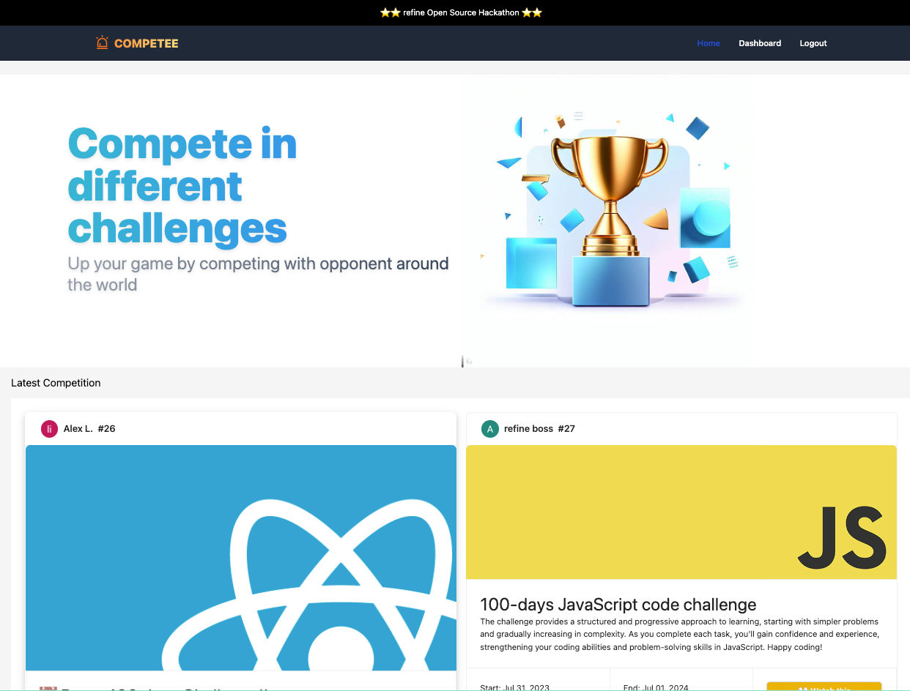

# Competee


## Project Demo link

[HERE](https://competee.vercel.app)

## About Competee

Competee is an open source online competition platform built using refine and React. It provides a dynamic and engaging environment for users to compete in various challenges, as well as create their own challenges for others to participate in. The platform fosters a vibrant community of creators and enthusiasts who can showcase their skills, exchange ideas, and vote for the best projects.

### Description

Competee was build using Refine and uses Supabase as the data provider, storage, and auth provider. Ant design and combine with TailwindCSS for the building of the UI.

**Key Features:**

1. **_Hosting Competition_**: Registered users can create unique challenges, specifying the theme, rules, and submission guidelines. Challenges can span a wide range of fields, including software development, design, art, writing, photography, and more. Creators have the flexibility to make challenges public or private, and they can set the duration for each challenge.

2. **_Participation and Submissions_**: Once a challenge is live, participants can join and submit their projects within the given timeframe.

3. **_Community Voting_**: To encourage interaction and engagement, Competee allows users to vote for their favorite submissions. Voting is open to all registered users.

### Participants

[Alex Li](https://github.com/alexcode4ever/)

### Preview

Landing page


Dashboard Accept Challenge (Dark)


Dashboard Submission (Dark)


### Set up Project

### Prerequisites

- Install Node.js and npm on your machine.
- Setup Supabase Project and configure supabaseClient.ts
  > Use the Database structure from [db_dump.sql](db_dump.sql) in Supabase.

### Installation

1. Clone the repository:

```bash
git clone https://github.com/alexcode4ever/competee`
```

2. Navigate to the project folder:

```bash
cd competee
```

3. Install dependencies:

```bash
npm install`
```

### Usage

1. Start development server

```bash
    npm run dev
```

2. Navigate to your localhost server and have fun!

## Learn More

To learn more about **refine**, please check out the [Documentation](https://refine.dev/docs)

- **Supabase Data Provider** [Docs](https://refine.dev/docs/core/providers/data-provider/#overview)
- **Ant Design** [Docs](https://refine.dev/docs/ui-frameworks/antd/tutorial/)
- **Inferencer** [Docs](https://refine.dev/docs/packages/documentation/inferencer)
- **React Router** [Docs](https://refine.dev/docs/core/providers/router-provider/)

## License

MIT
